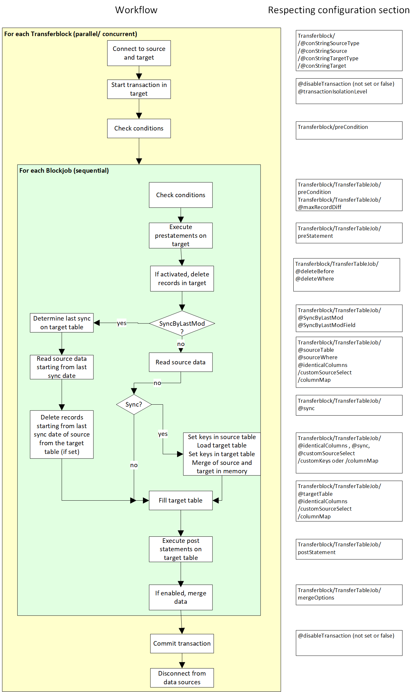

[Back to index](docIndex.md)

# Transfer job structure

## General structure
Transfer jobs are xml files, which define the source and the target data source of a transfer, called TransferBlock, and the source data and target tables to fill, called TransferTableJob.
Within TransferTableJobs column mappings can be defined to transform data or map columns with diffrent names in the source or target table.
This structure is shown below.


The job xml is delivered with an XSD schema definition file to help you writing own job files. 
All you need is a xsd capable editor, i.e. Visual Studio Code with [Red Hat XML Plugin](https://marketplace.visualstudio.com/items?itemName=redhat.vscode-xml). 
This enables context help, code completion and some validation, depending on the used editor. 

The xsd file is shipped in english. A [german version](de/job.xsd) is in the content/de part of the documentation.
Referencing the xsd job is done with the following base structure, assuming job.xsd is in the same path.
```
<?xml version="1.0"?>
<TransferJob xmlns:xsd="http://www.w3.org/2001/XMLSchema" xmlns:xsi="http://www.w3.org/2001/XMLSchema-instance" xsi:noNamespaceSchemaLocation = "job.xsd">
...
</TransferJob>
```

XPath is used when refering to elements in this documentation.

## Basic functionality

### TransferBlock

Each Transferblock builds a transactional scope for operations between 2 data sources. You have to assign an unique name to each.

#### Data source types

The data transfer uses ADO.Net data sources to connect to diffrent data sources along side some custom added data sources. To define which data source to use, the xml attributes Transferblock/@SourceType and Transferbloc/@TargetType are used.
The names of the data sources are provided by the manufacturer. Examples are

| System     | Type name  | 
| ------------- | ----- |
| MSSQL | System.Data.SqlClient |
| ODBC | System.Data.Odbc |
| OLE | System.Data.OleDb |
| MySql/MariaDB | MySql.Data.MySqlClient |
| CSV | Custom.CSV |
| ... | ... |

```
<transferBlock name="myBlock" 
	conStringSourceType="IBM.Data.DB2" conStringSource="..."
	conStringTargetType="System.Data.SqlClient" conStrintTarget="...">
		...
</transferBlock>
```

Be aware that some database drivers are dependent on the correct build architecture like x86 and x64. 
You have to use a version of datatransfer in the correct architecture to use these data sources.
Sometimes it is also needed to install some software from the manufacturer before the ADO.NET driver is working, i.e. DB2 Data Client for DB2 or ODAC for Oracle.

#### Connection strings

Now that the type of data source is defined, the actual connection data to an instance of this data type has to be specified. This is done with the attributes TransferBlock/@conStringSource and TransferBlock/@conStringTarget. The format of these connection string is defined by the ADO.Net provider. A good help page for these formats are the manufacturer´s help pages or [wwww.connectionstrings.com](https://www.connectionstrings.com/). Passwords in connection strings are omitted in log files.
For custom data source connection strings, please see the tutorial section and the DSL section [defining origins and remote request](DSL.md#Defining-origins-and-remote-request).

Windows only: Because connection strings often have passwords within, it is possible to encrypt these. For encryption Windows ProtectedData (DPAPI) is used. The tool CryptPassword.exe.zip is shipped within the release of datatransfer which converts a password text to UTF8 bytes, then encrypts it with DataProtect (machine/user options) and converts the result to Base64. The resulting base64 strings can be used in connectionstrings for the property names 'pwd', 'Password' and 'password'. 

```
<transferBlock name="myBlock" 
	conStringSourceType="IBM.Data.DB2" conStringSource="Server=databaseserver:50000;Database=dbname;UserID=db2admin;password=Base64PW"
	conStringTargetType="System.Data.SqlClient" conStrintTarget="Data Source=(localdb)\MSSQLLocalDB;Initial Catalog=SQL_DWH;Integrated Security=True;Connect Timeout=30;Encrypt=False;TrustServerCertificate=False">
		...
</transferBlock>
```

### TransferTableJob

The TransferBlock is the context for all TransferTableJobs. In the most simple form TransferTableJobs only have 3 attributes:
- TransferTableJob/@sourceTable (maybe with TransferTavbleJob/@sourceWhere) or alternative TransferTableJob/customSourceSelect
- TransferTableJob/@targetTable
- TransferTableJob/@identicalColumns or TransferTableJob/ColumnMap

With these attributes/elements the source data set and target table is defined. The name of sourceTable/targettable should be in the native way the data provider needs. For example Excel tables are referenced with [SourceSheet$A:D] (Sheet SourceSheet column A to D).

The attribute @identicalColumns starts by checking all columns in the source (or customSourceSelect) and assumes in the target table are identical named columns too. The target can have more columns too.

@sourceWhere and @SourceTable makes most sense if used with identicalColumns, so you can omit a customSourceSelect and a ColumnMap.

```
<TransferTableJob sourceTable="mySource" targetTable="myTarget" identicalColumns="true"/>

<TransferTableJob targetTable="myTarget" identicalColumns="true">
  <customSourceSelect> SELECT col1, col2*3 as col2_m from mySource  </customSourceSelect>
</TransferTableJob>
```

If no identicalColumns are defined, you have to define a columnMap with TransferTableColumn elements, which map source column (customSourceSelect) names to the target column names.
The columnMap or the customSourceSelect allow full usage of the query syntax of the source data source.

```
<TransferTableJob sourceTable="mySource" targetTable="myTarget">
	<columnMap>
		<TransferTableColumn sourceCol="col1" targetCol="col1_othername"/>
		<TransferTableColumn sourceCol="4" targetCol="constantTarget"/>
		<TransferTableColumn sourceCol="cast(replace(col3, ',', '') as integer)" targetCol="col3"/>
		<TransferTableColumn sourceCol="(Select singleVal from Tab2 where Tab2.key = Tab1.Key)" targetCol="col4"/>
	<columnMap>
</TransferTableJob>
```

## Workflow functionality

DataTransfer has only basic workflow functionality and follows a prescribed order in processing. There are just a few spots which are used as injection points for own logic or functionality.

Some of them has to set for specific data sources, i.e. disabling of transaction for data providers which does not support thise.

The basic workflow looks like this:



### Transaction settings

You can enable/disable transactions on the target data source with TransferTableJob/@disableTransaction. To disable the transactions in generally not recommended, but can be necessary if the target does not support these. I.e. Access or file formats does not support transactions.

With the addition of TransferTableJob/@transactionIsolationLevel you can set the needed isolation level - default is serializable. For more information on transactions and isolation levels please refer to your data source provider documentation.

```
<transferBlock name="myBlock" 
	conStringSourceType="..." conStringSource="..."	conStringTargetType="..." conStrintTarget="..."
	disableTransaction = "false" transactionIsolationLevel = "ReadCommited">
		...
</transferBlock>
```

### Pre-conditions

Pre-conditions can be used on TransferBlock (TransferBlock/preCondition) and/or on TransferTableJob (TransferTableJob/preCondition) level. On TransferBlock level they are once checked for the whole block and on TransferTableJob level before running the specific TransferTableJob.
You can specify as many needed. They are processed in order of appearance.

Each pre-condition can either pe checked on the source or the target data source. This is specified at preCondition/@checkOn.

With preCondition/@retryCount and preCondition/@retryDelay additonal tries can be defined, if the check fails. preCondition/@retryCount sets the amount of retries and preCondition/@retryDelay the seconds to wait between the retries.

To get the date for the check you have to specify a query with preCondition/@select on the data source which returns the values to be checked. If multiple records are returned by your query only the first record is checked.

The check itsself is defined in preCondition/@condition. The syntax is [colname]:[desiredVale]. You can set multiple conditions by seperating them with ;.

```
<transferBlock name="myBlock" 
	conStringSourceType="..." conStringSource="..."	conStringTargetType="..." conStrintTarget="...">
	
	<preCondition checkOn="Target" select="Select count(*) as cnt from MyTab" condition="cnt:0"/>

	<preCondition checkOn="Source" select="Select 1 as result from MyTab where exists(complicated subselect)" condition="result:1"/>

	<TransferTableJob sourceTable="..." targetTable="...">
		<preCondition checkOn="Source" retryCount="5" retryDelay="10" select="Select col1, col2 from sourceTab" condition="col1:test;col2:other"/>
	</TransferTableJob>
</transferBlock>
```

### Record diffrence check

Another special form of condition is the record diffrence check. It checks the record count on the target and compare it with the record count to transfer on source. If the new record has less than a specified percentage of the current target data, the processing is aborted.
The allowed maximum diffrence is defined with TransferTableJob/@maxRecordDiff in percentage. 
This scenario is mostly used for DWH transfers, where the source data is sometimes incomplete and has to be checked before.

```
	<TransferTableJob sourceTable="sourceTab" targetTable="targetTab" maxRecordDiff = "60" />
```

Example: Assume that targetTab has currently 100 records. If maxRecordDiff is 60, the transfer is aborted if there are less than 40 records in sourceTab to transfer, because more than 60% of data would be deleted in the target table.

### Pre and post SQL statements

Pre und post SQL statements can be executed in any amount for each TransferTableJob. They are always executed on the target data source, because of the transactional scope which only exists there. 
They are executed before the transfer starts modifying data and after the transfer is done. Only exception is [merging](TransferJob.md#Synchronizing-and-merging), which is always processed as last step.
These statement can execute any abritary SQL like stored procedures.

```
	<TransferTableJob sourceTable="sourceTab" targetTable="targetTab" >
	  <preStatement> UPDATE tempTab set x='y'</preStatement>
	  <preStatement> Exec logProcess('myLoggingStart') </preStatement>
	  ...
	  <postStatement> Exec logProcess('myLoggingEnd') </postStatement>
	</TransferTableJob>
```

### Deletion before filling

If you just want to transfer data, without synching or merging, you can delete the content of the source table before loading the new data. There is no danger of data loss, if you are using a transaction, because its just rolled back on error. Please be aware that database trigger may fire on deletion.
To activate the deletion use TransferTableJob/@deleteBefore. To restrict the set of deleted data add TransferTableJob/@deleteWhere.

The same can achieved by using a preStatement sql.

```
	<TransferTableJob sourceTable="sourceTab" targetTable="targetTab" deleteBefore = "true" deleteWhere = "type = 'server'" />
```

### Batch size

DataTransfer inserts, updates and deletes records with SQL statements. If 100.000 of records are inserted, the communication overhead for every single insert/update/delete statement can become a bottle neck.
Because of this, DataTransfer assembles single updates/inserts/deletes to batch jobs, so that multiple commands are sent to the server at once. This has big effects on performance but is sometimes a bit complicated to debug, because of error messages which just refer to 1 entry of a 1000 command batch. The drawback can be softened by using the [-d debug parameter in command line](datatransfer.exe.md#Parameters) which sets the batch size for this run to 1.
The attribute to configure is set at transferBlock/@targetMaxBatchSize.

Some data sources doesn´t support batches at all, i.e. some ODBC data sources. In this case this parameter has to be set to 1. 

On non-ADO data sources this parameter has no effect.

```
<transferBlock name="myBlock" conStringSourceType="..." conStringSource="..."	conStringTargetType="..." conStrintTarget="..."
	targetMaxBatchSize = "1" >
</transferBlock>
```

## Synchronizing and merging

Let´s start with a definition for clarification: 
- Merging is a UPSERT = Insert and Update process on a target table. No deletions are done.
- Synchronizing is a comparision of 2 data sets where the target data set is manipulated that it equals the source data set. This includes Insert, Updates and Deletes.

With this definition, merging is a synchronization without deletes. 

In the context of the dataTransfer a synchronization is always over a data boundary between a target and a source data provider. A merge is always a followed step in the target data provider. The image below shows this behaviour.


This means that a merge is a build in functionality of a [post statement](TransferJob.md#Pre-and-post-SQL-statements) for the merge syntax of the target provider.

### Synchronizing

Synchronizing in dataTransfer is a very versatile feature. It is possible to sync subsets of records on the source with subsets of records of the target on subsets of columns. Additionally you can (de)activate inserts, updates and deletes as needed.


To activate a sync you have to set the attribute TransferTableJob/@sync to true.

To get the sync working a key must be present to match the records. This key can be set in the [TransferTableJob/columnMap](TransferJob.md#TransferTableJob)/TransferTableColumn/@isKey. It can be set on multiple columns to define multi-column keys. 
If you use [TransferTableJob/@identicalColumns](TransferJob.md#TransferTableJob) you don´t are forced to list all columns if you use the elements TransferTableJob/customKeys which behaves identical to columnMap, but does not need all columns to be mapped.

```
<TransferTableJob sourceTable="sourceTab" targetTable="targetTab" sync="true">
	<columnMap>
		<TransferTableColumn sourceCol="KeyColonSource" targetCol="KeyColOnTarget" isKey="true" />
		<TransferTableColumn sourceCol="dataColSource" targetCol="dataColTarget" />
		<TransferTableColumn sourceCol="dataColSource2" targetCol="dataColTarget2" />
	</columnMap>
</TransferTableJob>
	
<TransferTableJob sourceTable="sourceTab" targetTable="targetTab" sync="true" identicalColumns="true">
	<customKeys>
		<TransferTableColumn sourceCol="KeyColonSource" targetCol="KeyColOnTarget" isKey="true" />
		<TransferTableColumn sourceCol="KeyColonSource2" targetCol="KeyColOnTarget2" isKey="true" />
	</customKeys>
</TransferTableJob>
```

To activate/deactivate inserts/updates/deletes use TransferTableJob/syncOptions with the attributes @noDeletes, @noInserts and @noUpdates. Default for all is false, and can be set to true.
```
<TransferTableJob sourceTable="sourceTab" targetTable="targetTab" sync="true" identicalColumns="true">
	<syncOptions noDeletes = "true" noUpdates = "false" />
	<customKeys> <TransferTableColumn sourceCol="KeyColonSource" targetCol="KeyColOnTarget" isKey="true" /> </customKeys>
</TransferTableJob>
```

To source data set is filtered like described at [TransferTableJob](TransferJob.md#TransferTableJob). 
The target data is filtered with TransferTableJob/@targetSyncWhere, which has to define a where statement for the target provider.

```
<TransferTableJob sourceTable="sourceTab" targetTable="targetTab" sync="true" identicalColumns="true" 
	sourceWhere = "type = 'Server'" targetSyncWhere="type = 'Server'">
	<customKeys> <TransferTableColumn sourceCol="KeyColonSource" targetCol="KeyColOnTarget" isKey="true" /> </customKeys>
</TransferTableJob>
```

#### Synchronizing by last modification

A special type of synchronization is the synchronization by last modification. This type allows to insert/update only records in the target table which have newer representations in the source table. 
To do this some configurations have to be set 
- TransferTableJob/@SyncByLastMod has to be "true"
- TransferTableJob/syncByLastModOptions/@SyncByLastModField should be the timestamp/datetime field name on both sides for a comparision (diffrent column names are not supported)
- TransferTableJob/syncByLastModOptions/@SyncByLastModMode should be set to a valid mode

The attributes [TransferTableJob/@sync](TransferJob.md#Synchronizing) and [TransferTableJob/SyncOptions](TransferJob.md#Synchronizing) do not apply for this synchronization type.
Filtering records on source or target still works like described [here](TransferJob.md#Synchronizing).

The behaviour of the syncrhonization by last modification is controlled by TransferTableJob/syncByLastModOptions/@SyncByLastModMode.
The following options are valid:
- APPEND : Appends all records of the source which have a bigger last modification date then the highest in the target data souce - no validations are made if the record already exists
- APPEND_INCLUDE_MAXDATE : Appends all records of the source which have a bigger or equal last modification date then the highest in the target data souce - no validations are made if the record already exists
- UPDATE_EXISTING : This mode needs at exact one key column [defined like here](TransferJob.md#Synchronizing). Before appending data like in the modes APPEND/APPEND_INCLUDE_MAXDATE, this mode checks for existing primary keys first and deletes then before appending. The result are updated and appended records in the target, to the newest state from the source table. Please note, that this runs deletes and inserts, which may result in triggered actions on your target table.

```
<TransferTableJob sourceTable="sourceTab" targetTable="targetTab" SyncByLastMod="true" identicalColumns="true" >
	<syncByLastModOptions SyncByLastModField="LastModDateTime" SyncByLastModMode="APPEND"/>
</TransferTableJob>

<TransferTableJob sourceTable="sourceTab" targetTable="targetTab" SyncByLastMod="true" identicalColumns="true" >
	<syncByLastModOptions SyncByLastModField="LastModDateTime" SyncByLastModMode="UPDATE_EXISTING"/>
	<customKeys> <TransferTableColumn sourceCol="KeyColonSource" targetCol="KeyColOnTarget" isKey="true" /> </customKeys>
</TransferTableJob>
```

Just to show a more advanced configuration options: A similar behaviour, with even more functionality, can be achieved by [variables](DSL.md#Variables) und TransferTableJob@sourceWhere. 
This example first initializes the variables, then uses them as to filter the source and then does a synchronization with only updates and inserts. With this option no deletes are executed at all and key comparision with multiple columns are possible.
```
<TransferTableJob sourceTable="sourceTab" targetTable="targetTab" sync="true" identicalColumns="true" sourceWhere = "LastModDateTime &gt; ${{MyLastModVar}}" >
	<syncOptions noDeletes = "true" />
	<variable name="MyLastModVar" type="DateTime" selectContext="Target" selectStmt="SELECT Max(LastModDateTime) as maxDatum from targetTab"/>
	<customKeys> <TransferTableColumn sourceCol="KeyColonSource" targetCol="KeyColOnTarget" isKey="true"/> </customKeys>
</TransferTableJob>
```

### Merging

Merging data in the meaning of dataTransfer is transfering data in the target between one and another table with insert/update and no deletes. No data boundaries between providers are passed.
This can always be archived by a [post statement](TransferJob.md#Pre-and-post-SQL-statements), but then you have to type the merge command yourself.

In the current release is the automatic building of merge comands for MSSQL data sources a built-in feature. To activate, you have to fill the TransferTableJob/MergeOptions.
First set TransferTableJob/MergeOptions/@merge as "true" and define a target table with TransferTableJob/MergeOptions/@targetTable. If you have identical columns between target table and merge table you can set TransferTableJob/MergeOptions/@autoMergeColumns to "true". If set to false TransferTableJob/MergeOptions/columnMap has to be defined. To define the merge keys use TransferTableJob/MergeOptions/mergeKey.

```
<TransferTableJob sourceTable="sourceTab" targetTable="targetTab_stage" identicalColumns="true" >
	<mergeOptions merge="true" autoMergeColumns="true" targetTable="targetTab_final" >
		<mergeKey sourceCol="Key" targetCol="Key" />
	</mergeOptions>
</TransferTableJob>
```

If you want to use this feature for other data provider than MS SQL you have to implement it in the provider class of the source code of dataTransfer or use manual written [post statements](TransferJob.md#Pre-and-post-SQL-statements).
```
public override async Task merge(string sourceTable, Model.TransferTableMergeOptions mergeOptions)
```
[Back to index](docIndex.md)